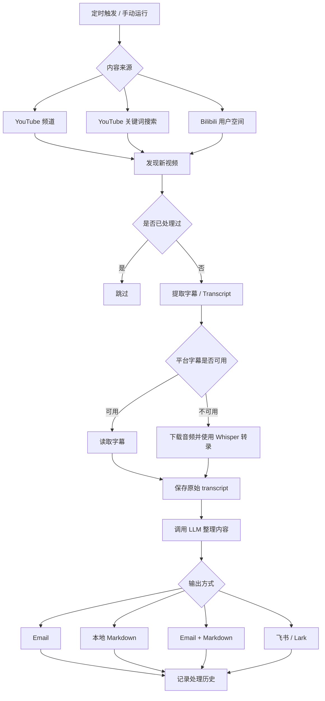
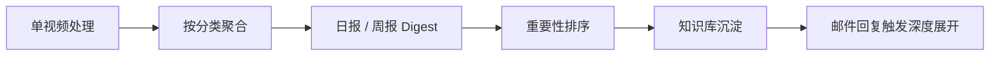

# VideoDigestAgent-custom

> 自动追踪 YouTube / Bilibili 视频更新，提取字幕或转录稿，调用大模型整理成结构化笔记，并推送到邮箱、飞书或本地 Markdown。

这个项目适合长期追踪 **AI、科技、商业、创业、产品、播客访谈** 等长视频内容。它把视频内容整理成更适合阅读、复盘和沉淀的个人视频情报资料。

> 

---

## TL;DR

```text
配置YouTube频道 / 关键词 / Bilibili 用户
        ↓
定时发现新视频
        ↓
提取字幕或使用 Whisper 转录
        ↓
保存原始 transcript
        ↓
调用 LLM 整理成结构化笔记
        ↓
发送到邮箱 / 飞书，或保存为 Markdown
```

---

## 为什么做这个项目

很多 AI、科技、商业和播客类视频信息密度高、时长长。如果每天手动检查博主更新，再逐个打开视频观看，会消耗大量时间。

这个项目希望把这件事自动化：

| 原本的问题              | 项目的处理方式                              |
| ------------------ | ------------------------------------ |
| 关注的频道太多，不想每天手动检查   | 定时监控 YouTube 频道、关键词和 Bilibili 用户     |
| 视频太长，看完成本高         | 自动提取字幕 / 转录稿，并让 LLM 整理重点             |
| 普通摘要太短，无法复盘内容逻辑    | 输出更接近「结构化视频笔记」的内容                    |
| 只收到一次性邮件，后续难以复用    | 同时保存原始 transcript 和 Markdown summary |
| 云服务器访问 YouTube 不稳定 | 支持通过环境变量配置 HTTP / HTTPS 代理           |

---

## 当前项目特点

| 特点     | 说明                                             |
| ------ | ---------------------------------------------- |
| 多来源监控  | 支持 YouTube 频道、YouTube 关键词搜索、Bilibili 用户空间      |
| 长视频友好  | 优先读取平台字幕，无字幕时使用 Whisper fallback               |
| 中文内容友好 | YouTube 字幕优先匹配中文语言代码，再 fallback 到英文            |
| 结构化整理  | 输出带标题、重点加粗和总结的 Markdown 内容                     |
| 原始材料留存 | 每个视频的 transcript 会保存到 `transcripts/`，方便复查和二次处理 |
| 多模型接入  | 支持 Gemini、OpenAI、Anthropic、OpenRouter          |
| 多输出方式  | 支持 `email`、`local`、`both`、`feishu`             |
| 可长期运行  | 支持 CLI、Web UI、tmux、cron、systemd 等运行方式          |

---

## 已实现 / 规划中

| 能力               |     状态 | 说明                               |
| ---------------- | -----: | -------------------------------- |
| YouTube 频道监控     |  ✅ 已实现 | 配置频道 handle 后检查新视频               |
| YouTube 关键词搜索    |  ✅ 已实现 | 可按关键词发现频道外内容，并设置配额与过滤规则          |
| Bilibili 用户监控    |  ✅ 已实现 | 配置 Bilibili UID 后检查用户空间投稿        |
| 字幕优先提取           |  ✅ 已实现 | 优先使用 YouTube / Bilibili 平台字幕     |
| Whisper fallback |  ✅ 已实现 | 无字幕时下载音频并本地转录                    |
| transcript 保存    |  ✅ 已实现 | 保存原始 transcript，便于后续复用           |
| LLM 结构化整理        |  ✅ 已实现 | 将 transcript 整理为 Markdown 笔记     |
| 邮件推送             |  ✅ 已实现 | 通过 SMTP 发送结果                     |
| 飞书 / Lark 推送     |  ✅ 已实现 | 通过机器人 webhook 推送                 |
| 本地 Markdown 归档   |  ✅ 已实现 | 保存 summary 到本地目录                 |
| Web UI           |  ✅ 已实现 | 支持运行、测试、配置和归档查看                  |
| 分类聚合邮件           | 🚧 规划中 | 当前主要按单个视频处理，后续可聚合为分类 digest      |
| 日报 / 周报模式        | 🚧 规划中 | 后续可将多个视频合并为一封周期简报                |
| 知识库接入            | 🚧 规划中 | 后续可接入 Notion、Obsidian、向量数据库或 RAG |

---

## 工作流程



---

## 输出内容长什么样

LLM 输出是更接近一份结构化视频笔记：

```markdown
# 整理后的原文内容

## 主题一：背景与问题
整理后的正文内容……

## 主题二：核心观点
- **关键判断**：……
- **重要数据**：……
- **事件结果**：……

# 重点内容总结
- 主要观点
- 关键事件
- 最值得记住的内容
```

原始 transcript 会单独保存，不会默认塞进邮件正文，避免邮件过长和可读性下降。

---

## 快速开始

### 1. 克隆项目

```bash
git clone https://github.com/Qsagacity/VideoDigestAgent-custom.git
cd VideoDigestAgent-custom
```

### 2. 创建虚拟环境

```bash
python3 -m venv .venv
source .venv/bin/activate
```

### 3. 安装依赖

```bash
pip install -r requirements.txt
```

如果需要 Whisper 转录，还需要安装 `ffmpeg`：

```bash
# macOS
brew install ffmpeg

# Ubuntu
sudo apt update && sudo apt install -y ffmpeg
```

### 4. 创建配置文件

```bash
cp .env.example .env
nano .env
```

### 5. 检查配置

```bash
python3 main.py --check
```

### 6. 单次运行

```bash
python3 main.py
```

---

## 最小配置示例

下面是一个「YouTube 频道监控 + Gemini + 邮件推送」的基础配置示例。

```env
YOUTUBE_CHANNELS=example_channel_1,example_channel_2
YOUTUBE_API_KEY=your_youtube_api_key

LLM_PROVIDER=gemini
GEMINI_API_KEY=your_gemini_api_key
GEMINI_MODEL=your_gemini_model

SUMMARY_LANGUAGES=Chinese
VERIFY_SUMMARY=false

OUTPUT_MODE=email
SMTP_SERVER=smtp.gmail.com
SMTP_PORT=587
SENDER_EMAIL=your_email@gmail.com
SENDER_PASSWORD=your_email_app_password
RECIPIENT_EMAILS=receiver@example.com

POLL_INTERVAL=43200
```

`POLL_INTERVAL=43200` 表示每 12 小时检查一次。代码默认值可以不同，但实际运行会以 `.env` 中的配置为准。

---

## 常用配置说明

| 配置项                          | 作用                                                  |
| ---------------------------- | --------------------------------------------------- |
| `YOUTUBE_CHANNELS`           | 要监控的 YouTube 频道 handle，多个用英文逗号分隔                    |
| `YOUTUBE_API_KEY`            | YouTube Data API Key                                |
| `YOUTUBE_SEARCH_QUERIES`     | YouTube 关键词搜索词，留空则关闭搜索                              |
| `BILIBILI_ENABLED`           | 是否启用 Bilibili 监控                                    |
| `BILIBILI_USERS`             | 要监控的 Bilibili 用户 UID                                |
| `LLM_PROVIDER`               | 可选 `gemini` / `openai` / `anthropic` / `openrouter` |
| `SUMMARY_LANGUAGES`          | 输出语言，最多建议配置 2 种                                     |
| `VERIFY_SUMMARY`             | 是否启用二次校验，开启后会增加模型调用成本                               |
| `OUTPUT_MODE`                | 可选 `email` / `local` / `both` / `feishu`            |
| `POLL_INTERVAL`              | 轮询间隔，单位为秒                                           |
| `HTTP_PROXY` / `HTTPS_PROXY` | 代理配置，适合云服务器访问 YouTube 时使用                           |

---

## 输出模式

| 模式       | 效果               | 适合场景       |
| -------- | ---------------- | ---------- |
| `email`  | 只发送邮件            | 日常阅读       |
| `local`  | 只保存 Markdown     | 本地测试、知识库整理 |
| `both`   | 发送邮件并保存 Markdown | 推荐，兼顾阅读和沉淀 |
| `feishu` | 推送到飞书 / Lark     | 群机器人、团队共享  |

---

## 常用命令

| 目标     | 命令                                           |
| ------ | -------------------------------------------- |
| 检查配置   | `python3 main.py --check`                    |
| 单次运行   | `python3 main.py`                            |
| 持续轮询   | `python3 main.py --poll`                     |
| 测试单个视频 | `python3 main.py --video VIDEO_ID`           |
| 只测试不发送 | `python3 main.py --video VIDEO_ID --dry-run` |
| 查看历史   | `python3 main.py --history`                  |
| 重试失败任务 | `python3 main.py --retry`                    |

Bilibili 视频可以直接传入 BV 号：

```bash
python3 main.py --video BVxxxxxxxxxx
```

---

## Web UI

启动 Web UI：

```bash
python3 app.py
```

默认访问：

```text
http://127.0.0.1:5000
```

如果部署在云服务器上，并希望外部访问：

```bash
python3 app.py --host 0.0.0.0 --port 8080
```

Web UI 适合做这些事：

* 查看运行状态
* 手动触发检查
* 测试指定视频
* 重试失败任务
* 查看本地归档
* 编辑配置

---

## 云服务器长期运行

### 方式一：tmux

适合快速部署和调试。

```bash
tmux new -s video-agent
cd ~/apps/VideoDigestAgent-custom
source .venv/bin/activate
python3 main.py --poll
```

退出但保持运行：

```bash
Ctrl + B，然后按 D
```

重新进入：

```bash
tmux attach -t video-agent
```

### 方式二：cron

适合固定时间间隔执行，例如每 12 小时运行一次。

```cron
0 */12 * * * cd /path/to/VideoDigestAgent-custom && /path/to/VideoDigestAgent-custom/.venv/bin/python main.py >> /tmp/video-digest.log 2>&1
```

### 方式三：systemd

适合长期稳定运行和自动重启。

```ini
[Unit]
Description=Video Digest Agent
After=network.target

[Service]
Type=simple
WorkingDirectory=/path/to/VideoDigestAgent-custom
ExecStart=/path/to/VideoDigestAgent-custom/.venv/bin/python main.py --poll
Restart=always
RestartSec=30

[Install]
WantedBy=multi-user.target
```

---

## 项目结构

| 文件 / 目录                   | 作用                          |
| ------------------------- | --------------------------- |
| `main.py`                 | CLI 主入口，负责运行、轮询、测试、历史和重试    |
| `app.py`                  | Flask Web UI                |
| `config.py`               | 读取和校验 `.env` 配置             |
| `youtube_monitor.py`      | YouTube 频道监控和关键词搜索          |
| `bilibili_monitor.py`     | Bilibili 用户空间监控             |
| `transcript_extractor.py` | 字幕提取、音频下载和 Whisper fallback |
| `summarizer.py`           | LLM 分类、整理和可选校验              |
| `emailer.py`              | 邮件格式化和发送                    |
| `feishu.py`               | 飞书 / Lark 机器人推送             |
| `history.py`              | 处理历史、失败记录和本地归档              |
| `transcripts/`            | 运行后生成，保存原始 transcript       |
| `summaries/`              | 运行后生成，保存 Markdown summary   |

---

## 当前限制

| 限制                    | 说明                            |
| --------------------- | ----------------------------- |
| 当前主要按单个视频处理           | 如果短时间内多个频道更新，可能会产生多封邮件        |
| 分类 digest 尚未完成        | AI / 科技 / 商业 / 金融等分类聚合仍属于后续规划 |
| 长视频无字幕时处理较慢           | Whisper 转录需要下载音频并消耗服务器资源      |
| 字幕质量会影响最终输出           | 平台字幕或 Whisper 识别错误会影响整理质量     |
| YouTube 搜索有 API 配额    | 关键词搜索需要控制频率和结果数量              |
| Bilibili cookies 可能失效 | 登录态过期后需要重新配置 cookies          |

---

## 后续方向



| 方向        | 价值                                              |
| --------- | ----------------------------------------------- |
| 分类聚合邮件    | 减少邮件数量，让同类内容集中阅读                                |
| 日报 / 周报模式 | 从“视频提醒”升级为“周期简报”                                |
| 重要性排序     | 根据频道、播放量、关键词和内容质量优先推送高价值视频                      |
| 知识库沉淀     | 将 transcript 和 summary 接入 Notion、Obsidian 或 RAG |
| 交互式追问     | 通过回复邮件编号，继续展开某个视频或主题                            |

---

## 安全提醒

不要把以下内容提交到 GitHub：

```gitignore
.env
.venv/
__pycache__/
*.pyc
transcripts/
summaries/
processed_videos.json
search_state.json
channel_cache.json
```

尤其不要公开：

* API Key
* 邮箱授权码
* 代理账号密码
* Bilibili Cookies
* 私人 transcript 或 summary

---

## 适合谁使用

| 用户                 | 使用价值                    |
| ------------------ | ----------------------- |
| AI 产品经理            | 追踪 AI 工具、模型、Agent 和产品趋势 |
| 科技 / 商业内容读者        | 降低长视频理解成本               |
| 播客和访谈内容重度用户        | 快速复盘嘉宾观点和讨论脉络           |
| 研究 / 写作 / 面试准备者    | 将视频内容沉淀为可复用素材           |
| 想搭建个人信息流 Agent 的用户 | 作为视频内容自动化工作流基础          |

