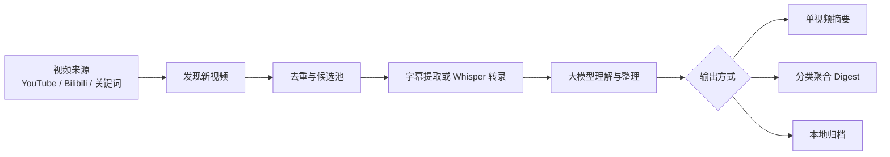

# VideoDigestAgent-custom

一个帮你长期追踪 YouTube / Bilibili 视频内容的个人信息助理。

它不是简单地“看到一个视频就总结一个视频”，而是可以把你关注的频道、关键词和内容源持续监听起来，自动发现新视频，提取字幕或转录音频，再用大模型整理成更容易阅读的内容。对于大量博主同时更新的情况，它还可以把视频按主题分类，合并成几封结构清晰的 Digest 邮件，减少信息轰炸。

你可以把它理解成一个面向视频内容的 **Personal Intelligence Agent**：

> 让机器帮你盯住视频信息流，把长视频变成可读、可筛选、可归档的知识简报。

---

## 为什么需要这个项目？

很多有价值的信息并不在文章里，而是在 YouTube、Bilibili 的长视频、访谈、播客和直播切片里。

但手动追踪这些内容有几个问题：

1. **信息源太分散**  
   一个 AI 产品经理、创业者或研究者，可能要同时关注几十个 YouTube 频道、B 站 UP 主和关键词搜索结果。

2. **长视频阅读成本高**  
   一个视频可能 30 分钟、1 小时甚至更长。即使标题有价值，也很难判断值不值得看完。

3. **更新频率不可控**  
   多个频道同时更新时，传统的“每个视频发一封摘要邮件”会很快变成信息轰炸。

4. **内容难以复盘**  
   看过的视频很容易忘，摘要如果不保存、不分类，也无法沉淀成后续写作、面试、研究和产品分析的素材。

这个项目要解决的就是这些问题：  
**自动发现视频、判断价值、提取内容、分类整理，并以更少、更清晰的邮件形式推送给你。**

---

## 它现在能做什么？

VideoDigestAgent-custom 目前主要支持两种使用方式。

第一种是 **单视频摘要模式**。  
如果你只想测试某个视频，或者频道数量不多，可以让程序发现一个新视频后，就为这个视频单独生成一份结构化摘要。这适合调试模型效果、检查字幕质量，或者快速分析一个指定视频。

第二种是 **分类聚合简报模式**。  
这是当前项目更重要的能力。它会在一轮检查中收集多个新视频，先根据时间、热度和内容相关性筛选，再把视频分成几个主题类别，最后合并成“目录邮件 + 分类正文邮件”。这样即使你关注了很多博主，也不会被几十封单独邮件淹没。

简单来说：

| 你想做什么 | 推荐模式 | 对应入口 |
|---|---|---|
| 测试一个视频能不能总结 | 单视频摘要 | `main.py` |
| 少量频道更新后逐个总结 | 单视频摘要 | `main.py` |
| 长期追踪大量频道和关键词 | 分类聚合简报 | `category_digest.py` |
| 每 6 小时 / 每 12 小时收一次整理后的信息流 | 分类聚合简报 | `category_digest.py --poll` |

---

## 产品工作方式

项目的整体逻辑可以概括为一句话：

> 先发现视频，再判断哪些值得处理，最后把长视频整理成适合阅读的内容。



这个流程里最重要的不是“调用了大模型”，而是项目把视频处理拆成了几个可控环节：

- 先确定哪些频道、关键词、UP 主值得追踪；
- 再判断哪些视频是新视频，避免重复处理；
- 有字幕就优先用字幕，没有字幕再用 Whisper 转录；
- 内容过长时分块处理，避免一次性塞给模型导致失败；
- 最后根据使用场景选择单视频摘要，还是分类聚合邮件。

---

## 分类聚合 Digest 是这个项目的核心改进

原始的视频摘要工具通常是这样的：

> 一个新视频 → 一封邮件 → 一个摘要。

这个方式在频道少的时候没有问题，但当你关注几十个博主时，很容易一天收到大量邮件。你真正想要的不是“每个视频都提醒我”，而是：

> 帮我先筛一遍，再按主题整理好，让我快速知道今天哪些内容值得看。

所以这个项目新增了 `category_digest.py`，它会把一轮更新的视频合并处理。

当前默认分成三类：

| 分类 | 适合内容 |
|---|---|
| AI 科技产品 | AI 工具、模型更新、Agent、产品设计、技术趋势 |
| 商业创业访谈 | 创业者访谈、商业模式、增长经验、产品经营 |
| 金融宏观新闻 | 宏观经济、市场变化、政策影响、产业新闻 |

一次运行后，它通常会生成：

1. **一封总目录邮件**  
   先告诉你这一轮有哪些重点内容，每个内容属于什么分类，为什么值得看。

2. **若干封分类正文邮件**  
   把同一类内容合并到一起，比如 AI 科技产品一封、商业创业访谈一封、金融宏观新闻一封。

3. **本地归档文件**  
   保存候选视频、入选视频、转录稿、整理后的正文和邮件内容，方便之后复盘。

这个设计的价值是：  
**它把“视频通知”变成了“主题简报”。**

---

## 一个典型使用场景

假设你关注了很多 AI 产品、科技评论、创业访谈和金融宏观频道。

以前你可能会遇到这种情况：

- 早上打开邮箱，发现十几封视频摘要；
- 每封都要点开看；
- 标题相似，但不知道哪个更重要；
- 真正有价值的内容被淹没在普通更新里。

使用分类聚合模式后，流程会变成：

- 程序每隔 6 小时检查一次；
- 先收集这一轮新视频；
- 再筛选出更值得处理的视频；
- 然后按 AI、商业、金融宏观分类；
- 最后只发少量几封结构化邮件。

你看到的不是零散视频，而是类似这样的信息：

```text
本轮重点目录
├── AI 科技产品：3 条
│   ├── 某个 Agent 产品更新：值得关注，因为体现了 AI 工具工作流化趋势
│   ├── 某模型评测视频：适合了解模型能力边界
│   └── 某 AI Coding 工具分享：适合产品经理理解开发工具变化
├── 商业创业访谈：2 条
└── 金融宏观新闻：2 条
```

这样你可以先看目录，再决定要不要深入阅读某一类正文。

---

## 支持的视频来源

目前项目支持三类来源。

| 来源 | 说明 |
|---|---|
| YouTube 频道 | 配置频道 handle 或频道 ID 后，自动检查频道新视频 |
| YouTube 关键词搜索 | 配置关键词后，自动搜索相关新视频 |
| Bilibili 用户空间 | 配置 B 站 UID 后，自动检查 UP 主投稿 |

YouTube 频道监控适合稳定追踪固定博主。  
YouTube 关键词搜索适合发现你没有关注但主题相关的新内容。  
Bilibili 监控适合补充中文视频信息源。

---

## 输出方式

项目支持多种输出方式：

| 输出方式 | 适合场景 |
|---|---|
| Email | 最适合长期自动推送，每轮直接发到邮箱 |
| Local Markdown | 适合本地归档、调试、后续整理 |
| Both | 同时发邮件和保存本地文件 |
| Feishu / Lark | 适合团队或工作群通知 |

如果你只是自己用，推荐先使用 Email + Local。  
Email 负责提醒和阅读，Local 负责留档和排查问题。

---

## 快速开始

### 1. 克隆项目

```bash
git clone https://github.com/Qsagacity/VideoDigestAgent-custom.git
cd VideoDigestAgent-custom
```

### 2. 创建虚拟环境

```bash
python3 -m venv .venv
source .venv/bin/activate
```

### 3. 安装依赖

```bash
pip install -r requirements.txt
```

如果需要在没有字幕时自动转录，还需要安装 ffmpeg：

```bash
# macOS
brew install ffmpeg

# Ubuntu / Debian
sudo apt update
sudo apt install -y ffmpeg
```

### 4. 创建配置文件

```bash
cp .env.example .env
nano .env
```

### 5. 检查配置

```bash
python3 main.py --check
```

---

## 最小配置示例

下面是一个使用 YouTube、Gemini 和邮件推送的基础配置示例。

```env
# YouTube
YOUTUBE_CHANNELS=RhinoFinance
YOUTUBE_API_KEY=your_youtube_api_key

# LLM
LLM_PROVIDER=gemini
GEMINI_API_KEY=your_gemini_api_key
GEMINI_MODEL=gemini-3.1-pro-preview
SUMMARY_LANGUAGES=Chinese

# Output
OUTPUT_MODE=email

# Email
SMTP_SERVER=smtp.gmail.com
SMTP_PORT=587
SENDER_EMAIL=your_email@gmail.com
SENDER_PASSWORD=your_gmail_app_password
RECIPIENT_EMAILS=receiver@example.com

# Polling
POLL_INTERVAL=21600
```

`POLL_INTERVAL=21600` 表示每 6 小时检查一次。

---

## 常用命令

### 单视频摘要模式

检查一次新视频：

```bash
python3 main.py
```

持续轮询：

```bash
python3 main.py --poll
```

测试一个指定视频，但不真正发送：

```bash
python3 main.py --video VIDEO_ID --dry-run
```

查看处理历史：

```bash
python3 main.py --history
```

重试失败视频：

```bash
python3 main.py --retry
```

### 分类聚合简报模式

单次生成 Digest：

```bash
python3 category_digest.py
```

持续轮询生成 Digest：

```bash
python3 category_digest.py --poll
```

测试 Digest 流程，但不发送邮件、不标记已发送：

```bash
python3 category_digest.py --dry-run
```

如果你部署在云服务器，并且目标是“每隔一段时间自动检查并发整理后的邮件”，建议运行：

```bash
python3 category_digest.py --poll
```

---

## 云服务器长期运行

### 使用 tmux

```bash
tmux new -s video-agent
cd ~/apps/VideoDigestAgent-custom
source .venv/bin/activate
python3 category_digest.py --poll
```

让程序继续运行并退出窗口：

```bash
Ctrl + B
D
```

重新进入：

```bash
tmux attach -t video-agent
```

### 使用 cron

如果你不想让程序一直挂着，也可以用 cron 定时运行。比如每天 0 点、6 点、12 点、18 点执行一次：

```cron
0 0,6,12,18 * * * cd /path/to/VideoDigestAgent-custom && /path/to/VideoDigestAgent-custom/.venv/bin/python category_digest.py >> /path/to/VideoDigestAgent-custom/logs/category_digest_cron.log 2>&1
```

如果使用仓库里的 `run_category_digest.sh`，需要先把脚本里的项目路径改成你服务器上的真实路径。

---

## 项目文件结构

```text
VideoDigestAgent-custom/
├── main.py                  # 单视频摘要入口
├── category_digest.py       # 分类聚合 Digest 入口
├── app.py                   # Web UI
├── config.py                # 读取配置
├── youtube_monitor.py       # YouTube 频道和关键词监控
├── bilibili_monitor.py      # Bilibili 用户监控
├── transcript_extractor.py  # 字幕提取和 Whisper 转录
├── summarizer.py            # 大模型摘要与整理
├── emailer.py               # 邮件发送
├── feishu.py                # 飞书 / Lark 推送
├── history.py               # 历史记录和失败重试
├── transcripts/             # 原始转录稿，运行后生成
├── summaries/               # 单视频摘要，运行后生成
└── digest_archive/          # 分类 Digest 归档，运行后生成
```

---

## Web UI

项目包含一个简单的 Web UI：

```bash
python3 app.py
```

默认访问：

```text
http://127.0.0.1:5000
```

如果部署在云服务器，并希望外部访问：

```bash
python3 app.py --host 0.0.0.0 --port 8080
```

Web UI 适合做配置、测试和查看归档。  
不过需要注意：当前 Web UI 主要面向 `main.py` 单视频摘要流程。如果你主要使用分类聚合 Digest，建议通过命令行、tmux、cron 或 systemd 运行 `category_digest.py`。

---

## 当前限制

这个项目已经可以用于个人自动化信息追踪，但仍有一些需要注意的地方：

1. **分类聚合模式和 Web UI 还没有完全打通**  
   Web UI 更偏向单视频摘要，分类 Digest 推荐用命令行运行。

2. **无字幕视频处理成本更高**  
   没有字幕时需要下载音频并用 Whisper 转录，速度更慢，也更消耗服务器资源。

3. **Digest 效果依赖模型质量和提示词**  
   分类、重要性判断和内容整理都依赖大模型，后续可以根据邮件实际阅读体验继续调参。

4. **YouTube 搜索会消耗 API 配额**  
   如果开启关键词搜索，需要注意 YouTube Data API 的额度限制。

5. **Bilibili Cookie 可能过期**  
   如果依赖 B 站字幕或登录态，Cookie 失效后需要重新配置。

---

## 不要提交到 GitHub 的内容

请不要把这些文件或信息提交到公开仓库：

```gitignore
.env
.venv/
__pycache__/
*.pyc
transcripts/
summaries/
digest_archive/
processed_videos.json
search_state.json
channel_cache.json
logs/
```

尤其不要公开：

- API Key
- 邮箱授权码
- 代理账号密码
- Bilibili Cookie
- 私人转录稿
- 私人摘要和 Digest 归档

---

## 后续可以怎么升级？

这个项目后续可以继续往几个方向发展：

| 方向 | 价值 |
|---|---|
| 日报 / 周报 | 把单轮 Digest 升级成周期性情报报告 |
| 邮件回复展开 | 通过回复编号，让系统继续深挖某个视频 |
| 更细分类体系 | 例如 AI Coding、Agent、宏观、投资、创业、产品增长 |
| 知识库沉淀 | 把高质量摘要保存到 Notion、Obsidian 或 RAG 系统 |
| 反馈闭环 | 根据点击、收藏、人工选择来优化排序和分类 |

---

## 一句话总结

VideoDigestAgent-custom 是一个面向视频内容的信息整理 Agent。  
它可以持续追踪 YouTube 和 Bilibili 的视频更新，把长视频转成结构化内容，并在视频数量较多时按主题聚合成 Digest 邮件，帮助你用更低成本获取、筛选和沉淀高价值信息。
