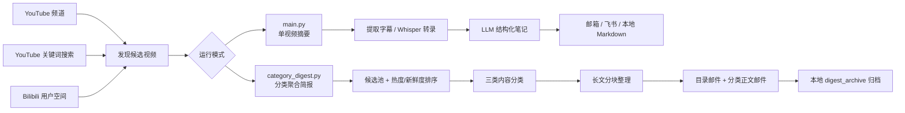
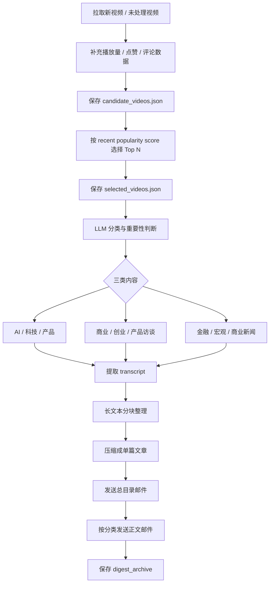
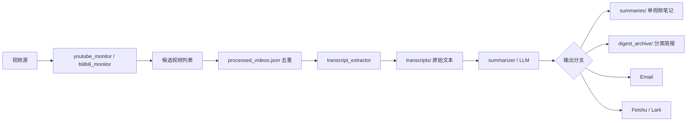
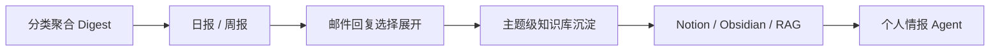

# VideoDigestAgent-custom

> 一个面向 YouTube / Bilibili 长视频的信息流自动化 Agent：  
> **自动发现更新 → 提取字幕/转录 → 调用 LLM 整理 → 按分类聚合 → 邮件/飞书/本地归档输出。**

这个项目适合长期追踪 **AI、科技、产品、商业、创业、金融宏观、深度访谈** 等内容，把原本分散、冗长、难复盘的视频信息，整理成可阅读、可归档、可二次利用的个人视频情报流。

---

## 1. 项目现在能做什么？



### 当前核心能力

| 能力模块 | 状态 | 说明 |
|---|---:|---|
| YouTube 频道监控 | ✅ 已实现 | 支持配置多个频道 handle 或频道 ID |
| YouTube 关键词搜索 | ✅ 已实现 | 可通过关键词发现频道外的新内容 |
| Bilibili 用户监控 | ✅ 已实现 | 支持配置 B 站 UID，追踪用户空间投稿 |
| 字幕优先提取 | ✅ 已实现 | 优先读取平台字幕，减少转录成本 |
| Whisper fallback | ✅ 已实现 | 无字幕时下载音频并使用 Whisper 转录 |
| 多模型接入 | ✅ 已实现 | 支持 Gemini / OpenAI / Anthropic / OpenRouter |
| 邮件输出 | ✅ 已实现 | 通过 SMTP 发送结果，支持多个收件人 |
| 飞书 / Lark 推送 | ✅ 已实现 | 支持机器人 webhook 推送 |
| 本地 Markdown 归档 | ✅ 已实现 | 保存 summary，方便后续复盘 |
| Web UI | ✅ 已实现 | 可视化配置、运行、查看归档 |
| 处理历史与失败重试 | ✅ 已实现 | 记录已处理、失败原因和重试次数 |
| 分类聚合 Digest | ✅ 已实现 | 按 AI科技产品 / 商业创业访谈 / 金融宏观新闻聚合输出 |
| 日报 / 周报模式 | 🚧 可扩展 | 当前已有周期聚合基础，可继续扩展成日报/周报 |
| 知识库接入 | 🚧 可扩展 | 可继续接入 Notion、Obsidian、向量数据库或 RAG |

---

## 2. 两种运行模式

这个项目现在有两条主线，适合不同场景。

| 模式 | 入口文件 | 输出方式 | 适合场景 |
|---|---|---|---|
| 单视频摘要模式 | `main.py` | 一个视频生成一份摘要 | 测试单个视频、少量频道、调试转录和模型效果 |
| 分类聚合简报模式 | `category_digest.py` | 多个视频按分类合并成 Digest 邮件 | 长期追踪大量博主，减少邮件数量，形成信息流简报 |

### 推荐使用方式

如果你只是测试一个视频：

```bash
python3 main.py --video VIDEO_ID --dry-run
```

如果你想长期自动追踪很多频道，并且不想收到几十封邮件：

```bash
python3 category_digest.py --poll
```

---

## 3. 分类聚合 Digest 是什么？

`category_digest.py` 会把一轮发现的视频先放入候选池，再根据热度、新鲜度、内容重要性进行筛选和分类，最后合并成更少、更可读的邮件。



### 默认三类

| 分类 Key | 邮件显示名 | 内容范围 |
|---|---|---|
| `ai_tech_product` | AI科技产品 | AI 工具、模型、Agent、科技产品、产品趋势 |
| `business_startup_interview` | 商业创业访谈 | 创业者访谈、商业模式、产品增长、企业经营 |
| `finance_macro_business_news` | 金融宏观新闻 | 宏观经济、市场、政策、产业新闻、商业事件 |

### Digest 邮件结构

```text
邮件 1：本轮重点目录
├── AI科技产品
│   ├── 视频 A：主题、重要性、链接、核心摘要
│   └── 视频 B：主题、重要性、链接、核心摘要
├── 商业创业访谈
└── 金融宏观新闻

邮件 2：AI科技产品｜重点整理
├── 内容 1：结构化正文
├── 内容 2：结构化正文
└── 内容 3：结构化正文

邮件 3：商业创业访谈｜重点整理
邮件 4：金融宏观新闻｜重点整理
```

这样可以把「很多频道、很多视频、很多邮件」变成「一个目录 + 少量分类正文」。

---

## 4. 快速开始

### 4.1 克隆项目

```bash
git clone https://github.com/Qsagacity/VideoDigestAgent-custom.git
cd VideoDigestAgent-custom
```

### 4.2 创建虚拟环境

```bash
python3 -m venv .venv
source .venv/bin/activate
```

### 4.3 安装依赖

```bash
pip install -r requirements.txt
```

如果需要 Whisper fallback，还需要安装 `ffmpeg`：

```bash
# macOS
brew install ffmpeg

# Ubuntu / Debian
sudo apt update
sudo apt install -y ffmpeg
```

### 4.4 创建配置文件

```bash
cp .env.example .env
nano .env
```

### 4.5 检查配置

```bash
python3 main.py --check
```

---

## 5. 最小配置示例

下面是一个「YouTube 频道监控 + Gemini + 邮件推送」的最小配置。

```env
# YouTube
YOUTUBE_CHANNELS=RhinoFinance
YOUTUBE_API_KEY=your_youtube_api_key

# LLM
LLM_PROVIDER=gemini
GEMINI_API_KEY=your_gemini_api_key
GEMINI_MODEL=gemini-3.1-pro-preview
SUMMARY_LANGUAGES=Chinese
VERIFY_SUMMARY=false

# Output
OUTPUT_MODE=email

# Email
SMTP_SERVER=smtp.gmail.com
SMTP_PORT=587
SENDER_EMAIL=your_email@gmail.com
SENDER_PASSWORD=your_gmail_app_password
RECIPIENT_EMAILS=receiver@example.com

# Polling
POLL_INTERVAL=21600
```

`POLL_INTERVAL=21600` 表示每 6 小时检查一次。

---

## 6. 关键配置说明

### 6.1 内容来源配置

| 配置项 | 是否必需 | 说明 |
|---|---:|---|
| `YOUTUBE_CHANNELS` | 可选 | 要监控的 YouTube 频道，多个用英文逗号分隔 |
| `YOUTUBE_API_KEY` | 视情况必需 | 使用 YouTube 频道或搜索时需要 |
| `YOUTUBE_SEARCH_QUERIES` | 可选 | YouTube 关键词搜索词，留空则关闭 |
| `BILIBILI_ENABLED` | 可选 | 是否启用 Bilibili 监控 |
| `BILIBILI_USERS` | 可选 | Bilibili 用户 UID，多个用英文逗号分隔 |
| `BILIBILI_SESSDATA` | 可选 | Bilibili 登录 Cookie，用于提高字幕获取成功率 |
| `BILIBILI_BILI_JCT` | 可选 | Bilibili Cookie |
| `BILIBILI_BUVID3` | 可选 | Bilibili Cookie |

### 6.2 模型配置

| 配置项 | 说明 |
|---|---|
| `LLM_PROVIDER` | 可选 `gemini` / `openai` / `anthropic` / `openrouter` |
| `GEMINI_API_KEY` | Gemini API Key |
| `GEMINI_MODEL` | Gemini 主模型 |
| `GEMINI_FALLBACK_MODELS` | Gemini fallback 模型链，主模型限额时自动尝试 |
| `OPENAI_API_KEY` | OpenAI API Key |
| `OPENAI_MODEL` | OpenAI 模型 |
| `ANTHROPIC_API_KEY` | Anthropic API Key |
| `ANTHROPIC_MODEL` | Claude 模型 |
| `OPENROUTER_API_KEY` | OpenRouter API Key |
| `OPENROUTER_MODEL` | OpenRouter 模型名 |

### 6.3 Digest 聚合配置

这些配置主要影响 `category_digest.py`。

| 配置项 | 默认值 | 作用 |
|---|---:|---|
| `DIGEST_MAX_VIDEOS_PER_CYCLE` | `10` | 每轮最多选择多少个视频进入 Digest |
| `DIGEST_CANDIDATE_MAX_AGE_HOURS` | `72` | 候选视频最大时间范围，单位小时 |
| `DIGEST_LIKE_WEIGHT` | `30` | 点赞权重 |
| `DIGEST_COMMENT_WEIGHT` | `10` | 评论权重 |
| `DIGEST_RECENCY_DECAY_POWER` | `0.6` | 新鲜度衰减系数 |
| `DIGEST_CHUNK_MAX_CHARS` | `12000` | 单个 transcript 分块大小 |
| `DIGEST_MAX_CHUNKS_PER_VIDEO` | `0` | 每个视频最多处理多少块，`0` 表示不限制 |
| `DIGEST_CONTENT_BATCH_SIZE` | `3` | 每封分类正文邮件包含多少篇内容 |
| `DIGEST_MAX_CONTENT_EMAILS_PER_CATEGORY` | `0` | 每个分类最多发几封正文邮件，`0` 表示不限制 |
| `DIGEST_BRIEF_MAX_CHARS` | `2000` | 普通内容正文长度上限 |
| `DIGEST_IMPORTANT_BRIEF_MAX_CHARS` | `2500` | 重要内容正文长度上限 |
| `DIGEST_ARCHIVE_DIR` | `digest_archive` | Digest 本地归档目录 |

### 6.4 输出配置

| 配置项 | 说明 |
|---|---|
| `OUTPUT_MODE=email` | 只发送邮件 |
| `OUTPUT_MODE=local` | 只保存本地 Markdown |
| `OUTPUT_MODE=both` | 发送邮件并保存本地 Markdown |
| `OUTPUT_MODE=feishu` | 发送到飞书 / Lark 机器人 |
| `SMTP_SERVER` | SMTP 服务器 |
| `SMTP_PORT` | SMTP 端口 |
| `SENDER_EMAIL` | 发件邮箱 |
| `SENDER_PASSWORD` | 邮箱授权码，不是邮箱登录密码 |
| `RECIPIENT_EMAILS` | 收件人，多个用英文逗号分隔 |
| `FEISHU_WEBHOOK_URL` | 飞书机器人 webhook |
| `FEISHU_SECRET` | 飞书机器人签名密钥，可选但推荐 |

---

## 7. 常用命令

### 7.1 单视频摘要模式：`main.py`

| 目标 | 命令 |
|---|---|
| 检查配置 | `python3 main.py --check` |
| 单次检查新视频 | `python3 main.py` |
| 持续轮询 | `python3 main.py --poll` |
| 测试单个 YouTube 视频 | `python3 main.py --video VIDEO_ID` |
| 测试单个 Bilibili 视频 | `python3 main.py --video BVxxxxxxxxxx` |
| 只测试不发送 | `python3 main.py --video VIDEO_ID --dry-run` |
| 查看处理历史 | `python3 main.py --history` |
| 重试失败任务 | `python3 main.py --retry` |

### 7.2 分类聚合简报模式：`category_digest.py`

| 目标 | 命令 |
|---|---|
| 单次生成分类 Digest | `python3 category_digest.py` |
| 持续轮询分类 Digest | `python3 category_digest.py --poll` |
| 只生成本地结果，不发送邮件、不标记已发送 | `python3 category_digest.py --dry-run` |
| 持续轮询但不发送 | `python3 category_digest.py --poll --dry-run` |

---

## 8. Web UI

启动 Web UI：

```bash
python3 app.py
```

默认访问：

```text
http://127.0.0.1:5000
```

如果部署在云服务器，并希望外部访问：

```bash
python3 app.py --host 0.0.0.0 --port 8080
```

Web UI 适合：

| 功能 | 说明 |
|---|---|
| 查看运行状态 | 看当前 Agent 是否正在运行 |
| 编辑配置 | 可视化编辑 `.env` 中的主要配置 |
| 手动触发运行 | 启动一次检查或轮询 |
| 测试指定视频 | 输入视频 ID 进行测试 |
| 查看归档 | 查看本地生成的 Markdown summary |
| 重试失败任务 | 对失败视频重新处理 |

> 注意：当前 Web UI 主要启动的是 `main.py` 单视频摘要模式。  
> 如果你要使用分类聚合 Digest，建议直接运行 `category_digest.py` 或配置 cron / systemd。

---

## 9. 云服务器长期运行

### 9.1 用 tmux 运行

适合快速部署和调试。

```bash
tmux new -s video-agent
cd ~/apps/VideoDigestAgent-custom
source .venv/bin/activate
python3 category_digest.py --poll
```

退出但保持运行：

```bash
Ctrl + B
D
```

重新进入：

```bash
tmux attach -t video-agent
```

### 9.2 用 cron 定时运行

适合固定时间点执行。比如每天 0 点、6 点、12 点、18 点运行一次分类 Digest：

```cron
0 0,6,12,18 * * * cd /path/to/VideoDigestAgent-custom && /path/to/VideoDigestAgent-custom/.venv/bin/python category_digest.py >> /path/to/VideoDigestAgent-custom/logs/category_digest_cron.log 2>&1
```

如果使用仓库里的 `run_category_digest.sh`，请先把脚本里的路径改成你服务器上的真实项目路径。

示例：

```bash
mkdir -p logs
nano run_category_digest.sh
chmod +x run_category_digest.sh
```

cron 示例：

```cron
0 0,6,12,18 * * * /path/to/VideoDigestAgent-custom/run_category_digest.sh
```

### 9.3 用 systemd 长期守护

适合生产环境长期运行。

```ini
[Unit]
Description=Video Digest Agent
After=network.target

[Service]
Type=simple
WorkingDirectory=/path/to/VideoDigestAgent-custom
ExecStart=/path/to/VideoDigestAgent-custom/.venv/bin/python category_digest.py --poll
Restart=always
RestartSec=30

[Install]
WantedBy=multi-user.target
```

---

## 10. 输出和归档结构

```text
VideoDigestAgent-custom/
├── main.py                         # 单视频摘要主入口
├── category_digest.py              # 分类聚合 Digest 主入口
├── app.py                          # Web UI
├── config.py                       # 读取 .env 配置
├── youtube_monitor.py              # YouTube 频道和关键词搜索
├── bilibili_monitor.py             # Bilibili 用户监控
├── transcript_extractor.py         # 字幕提取和 Whisper fallback
├── summarizer.py                   # LLM 调用、整理、校验
├── emailer.py                      # 邮件发送
├── feishu.py                       # 飞书 / Lark 推送
├── history.py                      # 处理历史与失败重试
├── processed_videos.json           # 已处理 / 失败记录，运行后生成
├── transcripts/                    # 原始 transcript，运行后生成
├── summaries/                      # 单视频 Markdown summary，运行后生成
└── digest_archive/                 # 分类 Digest 归档，运行后生成
    └── YYYYMMDD_HHMMSS/
        ├── candidate_videos.json
        ├── selected_videos.json
        ├── items/
        ├── transcripts/
        └── emails/
```

---

## 11. 数据流和文件流



---

## 12. 适合的使用场景

| 用户 / 场景 | 使用价值 |
|---|---|
| AI 产品经理 | 追踪模型、Agent、AI 产品和行业趋势 |
| 创业 / 商业内容读者 | 快速理解长访谈和商业观点 |
| 金融宏观观察 | 聚合市场、政策、宏观和产业事件 |
| 研究 / 写作 / 面试准备 | 把视频内容沉淀为可复用素材 |
| 信息流自动化爱好者 | 搭建自己的视频情报 Agent 工作流 |

---

## 13. 当前限制

| 限制 | 说明 |
|---|---|
| Web UI 主要运行 `main.py` | 分类 Digest 目前建议通过命令行、cron 或 systemd 运行 |
| 长视频无字幕时较慢 | Whisper fallback 需要下载音频并消耗服务器资源 |
| 字幕质量影响输出质量 | 平台字幕或 Whisper 识别错误会影响最终整理 |
| YouTube Search 有 API 配额 | 关键词搜索会消耗 YouTube Data API 配额 |
| Bilibili cookies 可能失效 | 登录态过期后需要重新配置 Cookie |
| Digest 仍依赖 LLM 判断 | 分类和重要性评分可能需要结合实际邮件效果继续调参 |

---

## 14. 安全提醒

不要把以下内容提交到 GitHub：

```gitignore
.env
.venv/
__pycache__/
*.pyc
transcripts/
summaries/
digest_archive/
processed_videos.json
search_state.json
channel_cache.json
logs/
```

尤其不要公开：

- API Key
- 邮箱授权码
- 代理账号密码
- Bilibili Cookies
- 私人 transcript
- 私人 summary / digest archive

---

## 15. 推荐迭代方向



| 方向 | 价值 |
|---|---|
| 日报 / 周报模式 | 从视频提醒升级为周期情报简报 |
| 邮件回复展开 | 通过回复编号触发某个视频的深度分析 |
| 更细分类体系 | 可扩展为 AI产品、AI coding、宏观、创业、投资等 |
| 知识库沉淀 | 将 transcript 和 summary 接入 Notion / Obsidian / RAG |
| 质量反馈闭环 | 根据点击、阅读、手动收藏来优化排序和分类 |

---

## 16. 一句话总结

**VideoDigestAgent-custom 现在不只是视频摘要工具，而是一个可以长期运行的个人视频情报 Agent：它能自动发现新内容、筛选重点、按主题聚合，并把长视频整理成更适合阅读和复盘的 Digest。**
